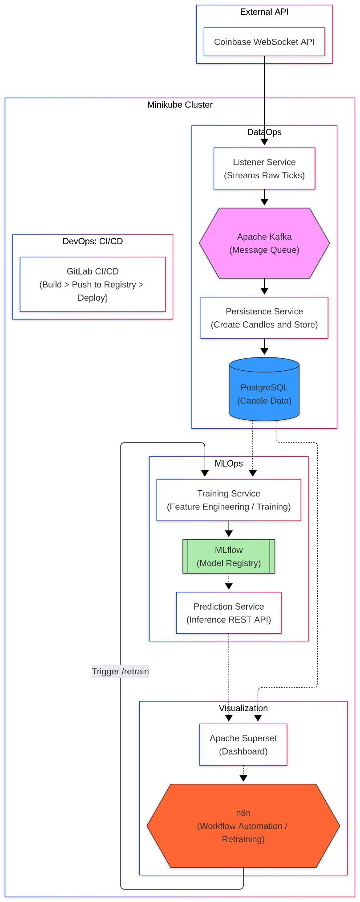

# Crypto Dashboard App

Crypto Dashboard adalah platform monitoring dan analisis cryptocurrency bitcoin yang mengintegrasikan pipeline data real-time dengan machine learning untuk memberikan saran buy/sell bitcoin. Sistem ini dibangun dengan arsitektur mikroservis yang berjalan di Kubernetes.

## Anggota Kelompok

| Nama                           | NIM      |
| ------------------------------ | -------- |
| Muhammad Atpur Rafif           | 13522086 |
| Andhika Tantyo Anugrah         | 13522094 |
| Ahmad Rafi Maliki              | 13522137 |
| Muhammad Rasheed Qais Tandjung | 13522158 |

## Daftar Services

| Service                        | Deskripsi                                 | Port       | Image                   |
| ------------------------------ | ----------------------------------------- | ---------- | ----------------------- |
| **Platform**                   |
| PostgreSQL                     | Database utama                            | 5432       | postgres:18             |
| Kafka                          | Message broker                            | 9092, 9093 | apache/kafka:4.1.1      |
| **DataOps**                    |
| Listener                       | Mendengarkan data dari Coinbase WebSocket | -          | dataops-listener:v1     |
| Persistence                    | Menyimpan data dari Kafka ke PostgreSQL   | -          | dataops-persistence:v1  |
| **ML-Ops**                     |
| MLflow                         | Tracking dan registry model ML            | 5001       | mlflow:v1               |
| ML Train                       | Service untuk training model              | 8000       | ml-train:v1             |
| ML Predict                     | Service untuk prediksi                    | 8000       | ml-predict:v1           |
| **Visualization & Automation** |
| Superset                       | Dashboard dan visualisasi data            | 8088       | superset-pgdriver:v1    |
| n8n                            | Workflow automation                       | 5678       | docker.n8n.io/n8nio/n8n |

## Arsitektur Sistem



## Struktur Project

- `apps/` - Source code aplikasi/services (ingestion, processing, inference, visualization)
- `infra/` - Konfigurasi infrastruktur & deployment
- `manifest.yaml` - Manifest Kubernetes gabungan untuk deployment lokal
- `build.sh` / `build.cmd` - Script build images untuk Linux/Mac / Windows

## Cara Setup dan Deployment Lokal

### 1. Setup Minikube

Install dan jalankan Minikube:

```bash
# Start minikube
minikube start

# Verifikasi minikube berjalan
minikube status
```

### 2. Build Docker Images

#### Untuk Linux/Mac:

```bash
# Berikan permission execute
chmod +x build.sh

# Build semua images
./build.sh
```

#### Untuk Windows:

```cmd
# Jalankan build script
build.cmd
```

### 3. Deploy ke Kubernetes

Apply manifest untuk deploy semua services:

```bash
kubectl apply -f manifest.yaml
```

### 4. Akses Services

Untuk mengakses services dari browser, gunakan `minikube service`:

```bash
# Akses Superset Dashboard
minikube service superset

# Akses n8n Workflow
minikube service n8n

# Akses MLflow UI
minikube service mlflow

# Atau cek semua services
kubectl get services
```
